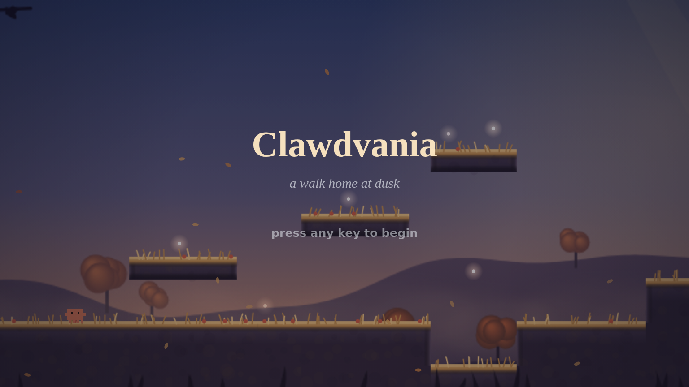

# Clawdvania

### ▶ [**Play it in your browser**](https://satejp10.github.io/Clawdvania/)

No install, no build step, nothing to download — it's one HTML file.

**A five-minute walk home at dusk**, starring **Clawd**, the orange pixel-crab. Cross the autumn hills as the light fades, gather the wisps that drift along the way (they'll orbit you and light your path), rest on the bench at the overlook, and make it to the cottage before dark. Inspired by the quiet moments of *Ori* and *Hollow Knight* — none of the combat, all of the atmosphere.

**Single self-contained `index.html`.** Vanilla JS + Canvas 2D. No engine, no build step, no asset files — Clawd is an inline pixel-array sprite and the world is entirely procedural. Open the file in a browser and play.

**Look:** a painterly *Autumn Dusk* atmosphere (gradient sky, god rays, parallax hills and trees, drifting leaves, soft turf) rendered smooth at the display's native resolution (HiDPI/`devicePixelRatio`-aware, so it's crisp — not pixelated — at any zoom). Clawd himself stays crisp pixel art as a deliberate contrast.

## Controls

| Key | Action |
|---|---|
| Arrows / A D | Move |
| Space / W / Up | Jump (tap = short hop, hold = full jump) |
| Jump again in mid-air | **Double jump** — one extra beat, given back by landing or catching a wall |
| Hold direction into a wall | **Cling** — hang on, slide slowly |
| Jump while clinging | Kick off the wall |
| R | Restart the walk — back to spawn, wisps returned to where you found them, ending re-armed |
| M | Mute audio |
| ` (backtick) | Debug overlay (pos, vel, coyote/buffer/air-jump/wall timers, FPS) |

**Clinging** works like Hollow Knight's Mantis Claw: in the air, hold the direction *into* a
wall and Clawd hooks on and slides down slowly. Keep holding to stay on — let go of that
direction and he drops. Jump while hanging and he kicks off the other way; hold the direction
again on the way back and you can work your way up a wall a kick at a time. He only grabs on
the way *down*, so jumping straight up a wall you're already pressed against gives you the
full jump rather than sticking you to it.

**The double jump** is one extra beat in the air, lighter than a standing jump and with its own
sound and a ring of kicked-out air underfoot. It's set rather than added to your speed, so a late
press still lifts you — and the best time to use it is right at the top of the first jump, which
takes a 49px hop to **85px**. You get it back by landing *or* by catching a wall, so a
cling-and-kick chain never strands you without one.

There are **12 wisps** on the way home. Two are somewhere you'd only look if you were curious. Standing still in the right spot opens a view.

**Mobile:** on-screen arrows + jump button appear automatically on touch devices (variable jump height works there too). The game plays in landscape — portrait shows a rotate prompt.

## Feel

All movement constants live in the `TUNING` object at the top of `index.html`: run acceleration, jump apex/time, asymmetric gravity, variable jump height, **100ms coyote time**, **120ms jump buffer**, camera lerp/deadzone/lookahead. The cling has its own block — slide speed, kick-off push, a **130ms** input lock after a kick-off so you actually clear the wall, and **90ms of wall coyote** so sliding past the end of a wall doesn't cost you the jump. The double jump is two more: how many air jumps you get between wall/ground touches, and how strong the second beat is against the first. Fixed-timestep simulation at 60Hz.

The gaps in the ground are **ditches, not pits** — they bottom out in earth two tiles down. Step in and hop out, or cling your way up the side.

## Status

The walk home is complete: title, wisps, deepening dusk, bench vista, ending, and fully synthesized audio (wind, footsteps, pentatonic chimes, an ending swell) — still one file, zero assets. Feel-tuning continues; whatever comes after the walk comes later.
